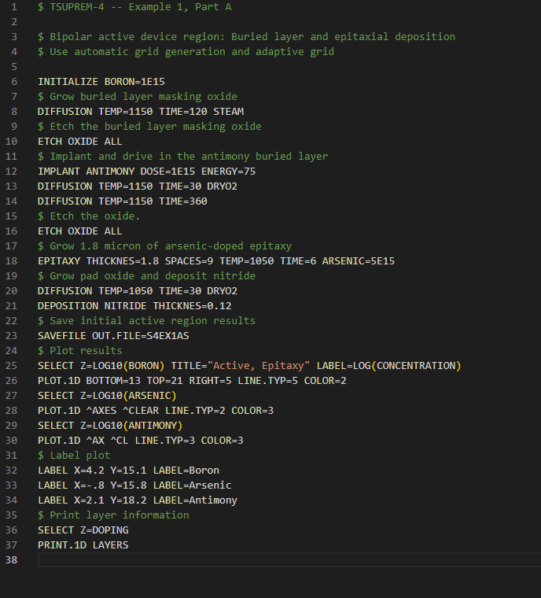

# tsuprem syntax highlighting extension

This extension for visual studio code provides the minimum amount of hints and syntax highlighting to the inp files that tsuprem uses.

# Table of Contents
1. [Usage](#Usage "Jump to usage")
2. [Example](#Example "Jump to Example")

## Usage
Download and put this folder into the following folder

- Windows %USERPROFILE%\.vscode\extensions
- macOS ~/.vscode/extensions
- Linux ~/.vscode/extensions

[More on Installing Extension](https://code.visualstudio.com/docs/editor/extension-marketplace "Visual studio code extension installation guide")

## Example

